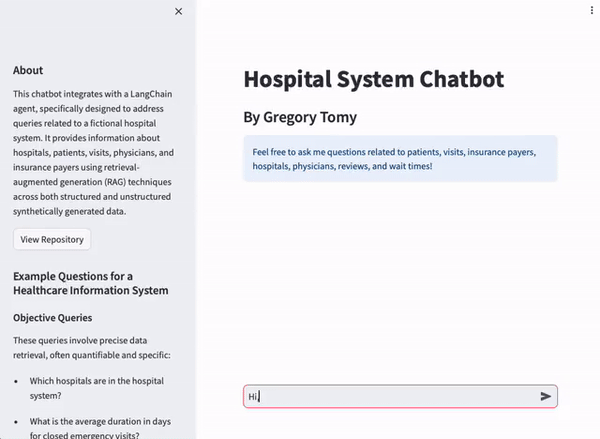
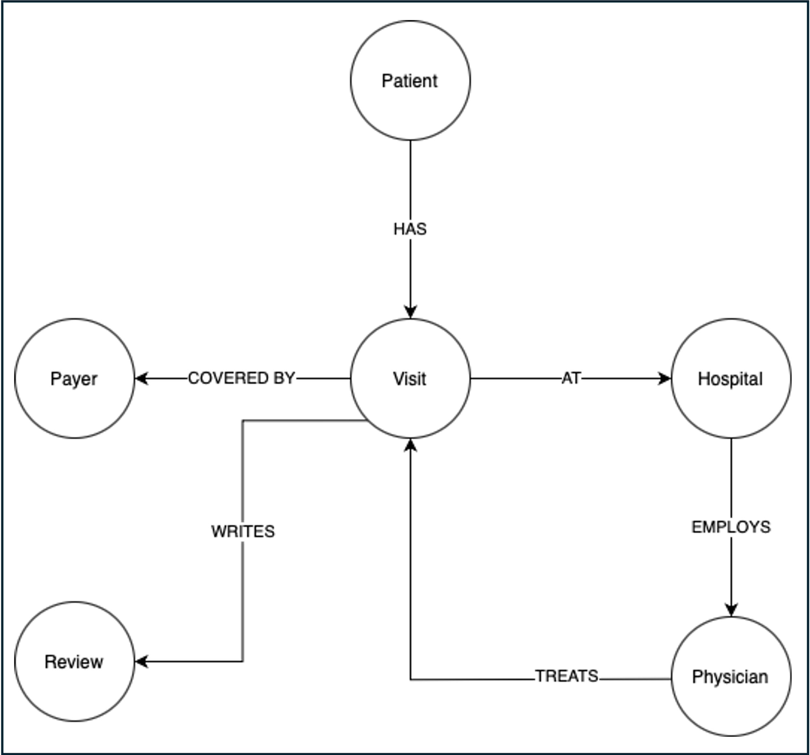
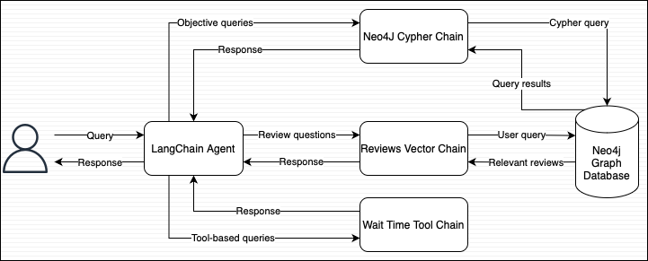

# Hospital Chatbot - LLMOps with LangChain and Neo4J


## Table of Contents
- [Introduction](#introduction)
- [Demo](#demo)
- [Business scenario](#business-scenario)
- [Dataset](#dataset)
- [Chatbot Solution](#chatbot-solution)
- [Prompt Engineering](#prompt-engineering)
- [Local Deployment](#local-deployment-guide)


## Demo
>The chatbot can be accessed at:
https://hospitalllm.azurewebsites.net/



## Business scenario
A large hospital system is seeking to enhance its ability to dynamically interact with and analyze vast amounts of patient, visit, physician, hospital, and insurance payer data. The goal is to develop a solution that enables non-technical stakeholders to obtain real-time insights through natural language queries, eliminating the need for expertise in SQL or reliance on data analysts for report generation and dashboard creation.

The stakeholders require answers to two primary types of questions, each demanding a different approach in query processing:

1. **Objective Queries**: These involve straightforward, quantifiable data retrieval such as calculating the total amount billed to a specific insurance provider within a given year. For example, stakeholders might ask, "What was the total amount billed to Blue Cross Blue Shield in the fiscal year 2023?" This type of question can typically be answered using predefined SQL queries, but creating new queries for each unique or nuanced question can be time-consuming and inefficient.
2. **Subjective Analysis**: These questions pertain to qualitative assessments and require parsing through narrative data sources like patient feedback. For instance, stakeholders might inquire, "What are the common themes in patient feedback regarding the cleanliness of the facilities?" or "How do patients describe their interactions with medical staff?" These queries necessitate advanced natural language processing capabilities to analyze sentiment, themes, and patterns within unstructured text data, providing a range of plausible insights rather than a single objective answer.

## Dataset

The datasets cover various aspects of hospital operations including details about hospitals, physicians, insurance payers, patient visits, and reviews. Find more details [here](data/README.md).

### Hospital Data Graph



## Chatbot Solution



To address the complex needs of the hospital's stakeholders, our solution incorporates a chatbot powered by an LLM agent, leveraging LangChain and Neo4J. This setup allows us to efficiently handle both structured and unstructured queries, enhancing the hospital's ability to interact with and analyze its data. The chatbot solution consists of three primary components:

1. **Objective Query Processor using Cypher Queries**:
    - For objective, data-specific queries, we utilize a Cypher Chain - a GPT 3.5 model integrated within LangChain. This model takes user inputs in natural language and converts them into Cypher queries. These queries are directly run on Neo4J, a graph database that houses structured data about hospitals, physicians, patient visits, and more. This approach allows for rapid and accurate data retrieval without requiring stakeholders to learn SQL or other database querying languages.
2. **Semantic Analysis with Vector Search**:
    - For subjective analysis and semantic queries, we employ a vector search index built into Neo4J. This allows for advanced natural language processing directly on the graph. We store vector embeddings alongside the structured data in the knowledge graph. This integration enables stakeholders to perform semantic searches, such as understanding themes from patient feedback or analyzing sentiments about hospital services, directly through the chatbot.
3. **External Data Integration for Dynamic Information**:
    - Recognizing that not all required information resides within our internal databases, we integrate external data sources for real-time data retrieval. This component of the solution includes custom functions within LangChain that simulate dynamic information such as current wait times at various hospital locations or identify the facility with the shortest wait time. These functions simulate external API calls and are crucial for providing timely and relevant information to stakeholders.

## Prompt Engineering
Prompt engineering is an essential component of our chatbot solution, playing a pivotal role in maximizing the performance and accuracy of the LLM agent. This process involves the design and refinement of the prompts used to interact with the model, ensuring they are clear, specific, and well-aligned with the model's capabilities and training data. The prompt to generate Cypher queries is below:

<div style="overflow-y: scroll; height:200px;">

```text
Task:
Generate Cypher query for Neo4j graph database

Instructions:
Use only the provided relationship types and properties in the schema.
Do not use any other relationship types or properties that are not provided.

Schema:
{schema}

Note:
Do not include any explanations or apologies in your repsponses.
Do not respond to any questions that might ask anything other than for you to construct a Cypher statement.
Do not include any text expect the generated Cypher statement. 
Make sure the direction of the relationship is correct in your queries.
Make sure you alias both entities and relationships properly.
Do not run any queries that would add to or delete from the database.
Make sure to alias all statements that follow as with statement (e.g. WITH v as visit, c.billing_amount as billing_amount)
If you need to divide numbers, make sure to filter the denominator to be non zero.

Examples:
# who is the oldest patient and how old are they?
MATCH (p:Patient)
RETURN p.name AS oldest_patient,
        duration.between(date(p.dob), date()).years AS age

# which physician has billed the least to Cigna
MATCH (p:Payer) <- [c:COVERED_BY] - (v:Visit) - [t:TREATS] - (phy:Physician)
WHERE p.name = 'Cigna'
RETURN phy.name AS physician_name, SUM(c.billing_amount) AS total_billed
ORDER BY total_billed
LIMIT 1

# Which state had the largest percent increase in Cigna visits
# from 2022 to 2023?
MATCH (h:Hospital)<-[:AT]-(v:Visit)-[:COVERED_BY]->(p:Payer)
WHERE p.name = 'Cigna' AND v.admission_date >= '2022-01-01' AND
v.admission_date < '2024-01-01'
WITH h.state_name AS state, COUNT(v) AS visit_count,
     SUM(CASE WHEN v.admission_date >= '2022-01-01' AND
     v.admission_date < '2023-01-01' THEN 1 ELSE 0 END) AS count_2022,
     SUM(CASE WHEN v.admission_date >= '2023-01-01' AND
     v.admission_date < '2024-01-01' THEN 1 ELSE 0 END) AS count_2023
WITH state, visit_count, count_2022, count_2023,
     (toFloat(count_2023) - toFloat(count_2022)) / toFloat(count_2022) * 100
     AS percent_increase
RETURN state, percent_increase
ORDER BY percent_increase DESC
LIMIT 1

# How many non-emergency patients in North Carolina have written reviews?
match (r:Review)<-[:WRITES]-(v:Visit)-[:AT]->(h:Hospital)
where h.state_name = 'NC' and v.admission_type <> 'Emergency'
return count(*)

String category values:
Test results are on of: 'Inconclusive', 'Normal', 'Abnormal'
Visit statuses are one of: 'OPEN', 'DISCHARGED'
Admission Types are one of: 'Elective', 'Emergency', 'Urgent'
Payer names are one of: 'Cigna', 'Blue Cross', 'UnitedHealthCare', 'Medicare', 'Aetna'

A visit is considered open if its status is 'OPEN' and the discharge date is missing.

Use abbreviations when filtering on hospital states (e.g. "Texas" is "TX", "Colorado" is "CO", "North Carolina" is "NC", "Florida" is "FL", "Georgia" is "GA, etc.)

Make sure to use IS NULL or IS NOT NULL when analyzing missing properties.
Never return embedding properties in your queries. You must never include the statement "GROUP BY" in your query. 
Make sure to alias all statements that follow as with statement (e.g. WITH v as visit, c.billing_amount as
billing_amount)

The question is:
{question}

```
</div>

## Local Deployment Guide
Coming soon!

---
#### Acknowledgements
Special thanks to [Harrison Hoffman](https://www.linkedin.com/in/harrison-f-hoffman/) for his excellent guide and insights.