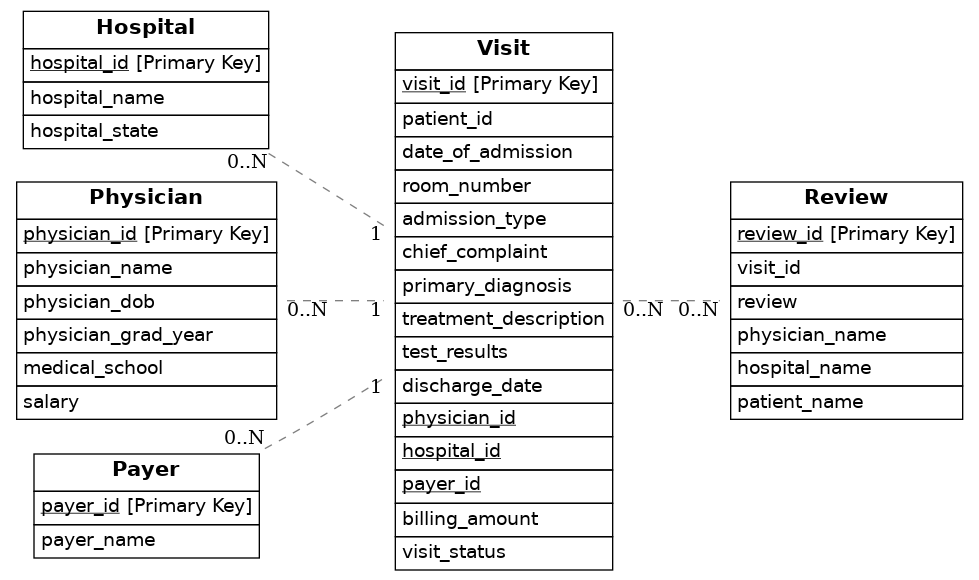

# hotel-llmops
[In Progress] Building a RAG chatbot in LangChain that uses Neo4j to retrieve data from multiple documents.

## Business scenario
A large hospital system is seeking to enhance its ability to dynamically interact with and analyze vast amounts of patient, visit, physician, hospital, and insurance payer data. The goal is to develop a solution that enables non-technical stakeholders to obtain real-time insights through natural language queries, eliminating the need for expertise in SQL or reliance on data analysts for report generation and dashboard creation.

The stakeholders require answers to two primary types of questions, each demanding a different approach in query processing:

1. **Objective Queries**: These involve straightforward, quantifiable data retrieval such as calculating the total amount billed to a specific insurance provider within a given year. For example, stakeholders might ask, "What was the total amount billed to Blue Cross Blue Shield in the fiscal year 2023?" This type of question can typically be answered using predefined SQL queries, but creating new queries for each unique or nuanced question can be time-consuming and inefficient.
2. **Subjective Analysis**: These questions pertain to qualitative assessments and require parsing through narrative data sources like patient feedback. For instance, stakeholders might inquire, "What are the common themes in patient feedback regarding the cleanliness of the facilities?" or "How do patients describe their interactions with medical staff?" These queries necessitate advanced natural language processing capabilities to analyze sentiment, themes, and patterns within unstructured text data, providing a range of plausible insights rather than a single objective answer.

## Dataset

The datasets cover various aspects of hospital operations including details about hospitals, physicians, insurance payers, patient visits, and reviews. Find more details 

